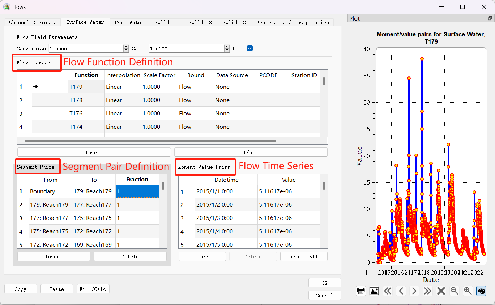
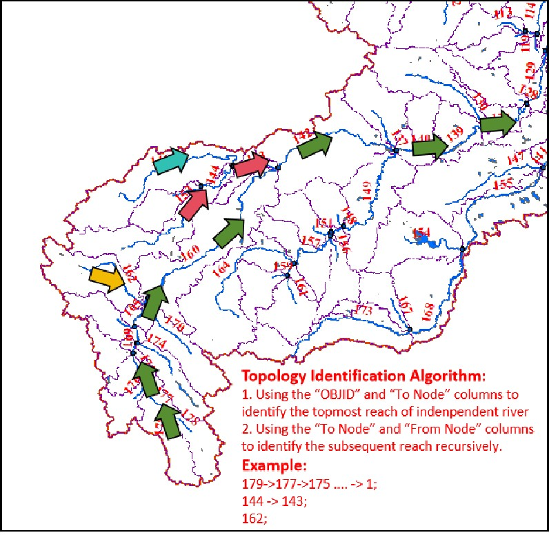

# **SWAT2WASP**

	

## Introduction

WASP 8 is a powerful tool for simulating water quality; however, it does not provide the flow generated from each sub-basin when used for basin-scale modeling. To address this limitation, it is necessary to integrate a hydrologic model to establish the required boundary conditions for WASP modeling. This integration will enable future predictions and scenario analyses based on the model. This code repository offers Python scripts to facilitate the integration of the SWAT model—one of the most widely used hydrologic models worldwide—with the WASP 8 kinematic wave simulation. This repository serves as a supplementary resource for the work presented in the paper titled “Simulation of Polycyclic Aromatic Compounds in the Athabasca River Basin: Integrated Models and Insights.”

## Dependencies

Numpy and Pandas

## Major Functionalities

### 1. Generating the WASP 8 river channels based on SWAT river

By using the class “SWATReachReader” in **read_swat_reach.py**, the program can generate the river channel information files to facilitate the WASP 8 model establishment. Those files include the “**Flow Function**” page and “**Segment Pair**” pages (linkage between river segments). 



The “Flow Function” page defines the inner boundaries of each river channel in the basin model. The flow function name starts with “T” denotes the flow function for the starting point of an independent tributary. For example, the name “T179” means the flow function for the tributary (or the tributary with the subsequent mainstem) starts at sub-basin 179, it will have river segment pairs with a series of downstream river channels (or the lower boundary), but its flow time series should still be the flow (WYLDmm, i.e. water yield in mm, see the SWAT documentation for more information) generated by sub-basin 179. The flow function name starts with “S” (e.g. S100) means that the respective river channel is a middle part (not an independent tributary) of a longer river channel, and this kind of flow function is only for the consideration of the inner runoff  (WYLDmm). The segment pair of “S100” is only from the boundary to itself without its downstream information, as this information is already defined in other river segment pairs in another (longer/parent) flow function.

For the generation of “Segment Pair” pages, the identification process of those linkages is achieved based on the "**OBJID**", “**From Node**”, and “**To Node**” columns in the attribute table of the river shape file (.shp line vector file) generated by ArcSWAT or QSWAT. It starts with the identification of the topmost tributaries and then searches for their downstream channels recursively. The longest flow path representing the mainstream along with other independent tributaries will be generated. 



To use this script for model preparation, first export the attribute table from the SWAT river shape file (.dbf format, which can be opened by Excel), then use the class and methods provided in read_swat_reach.py. The generated .xlsx files can be directly copied and pasted in the WASP model. Those integers in the files representing the index of the option in the WASP8 user interface.

```python
import pandas as pd

df = pd.read_excel(r"river.xlsx") 
reader = SWATReachReader(df,mode="ASCENDING")
reader.write_tributaries(r"tributaries.txt")
reader.write_flow_function(r"FlowFunc.xlsx") 
reader.write_segment_pairs(r"SegmentPairs.xlsx")
```

### 2. Generating the WASP 8 external database based on SWAT results

For all the flow functions defined in the WASP model, the flow time series can either be pasted from the spreadsheet or linked to the external database. The script named “**SWAT2ExtDatabase.py**” (should be used with “read_res.py”) provides the functionality to convert the SWAT result into a WASP8 external database. This external database is in a .csv format, which can be directly linked to the WASP model. The integration between SWAT and WASP8 is then completed. However, we recommend still pasting the SWAT time series into the WASP model this time series is fixed during your simulation. The reason is that the IO processes for external databases in the WASP model are slow.

```Python
from read_res import SWATreader
import pandas as pd
# Your SWAT (scenario) model folder, output path, output variable
# Use the WYLDmm (water yield in mm) as the WASP model input 
convert(r"D:\AthaSWATModel","ExternalFlow.xlsx",variables=["WYLDmm"])
write_linkfile(r"FlowFunc.xlsx",r"ExternalFlow.xlsx","ExternalLink.xlsx")
```

### 3. Read SWAT results

As a by-product, the class SWATreader in “**readres.py**” can be used to read the SWAT simulation results (only result files with full variables). 

```Python
import os
import pandas as pd
import numpy as np
import datetime

TxtInOut =  r"D:\AthaSWATModel"
swatreader = SWATreader(TxtInOut)
res = swatreader.read_rch()
bnd = swatreader.inquireRchFlow(111, "2015-01-01", "2022-12-31")
```

